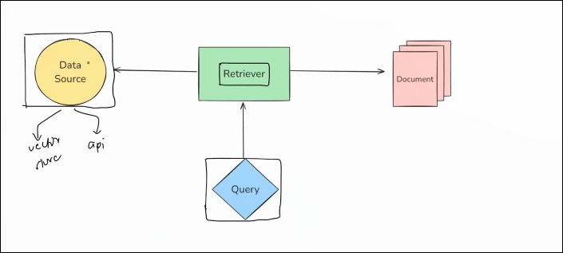
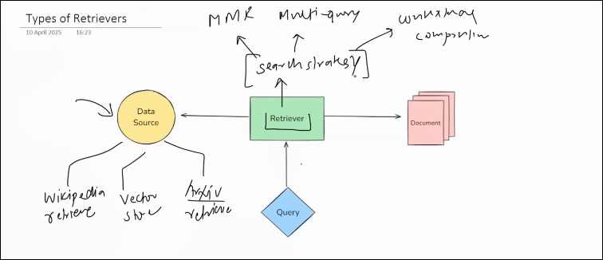
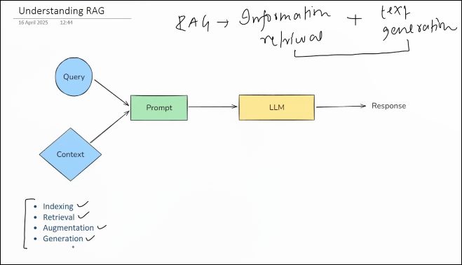

Tool is just a python function that is package function that is packagess in a way the llm can understand and call when  needed 

tools are 2 types 
1 built in tool 
2 custom tools 

Some example of tools are 
duckDuckGo 
shell tool 
api 
database 

Agent 
  is llm powered that can think and decide and take action using external tools or api to achive goal 
  
  2 custom tools :) 
    when u want to call you own apis 
    encapsulate business logic 
    llm to interact you databse paroduct or app 

M3thod 01 
using @Tool decorator 

Making of a custom tool 
A ) make a function  you have to add the doc string 
b )  add type hints  excepting type and return type 
c )  add tool decorator ( @tool ) 

llm dont get the function they get the json schema fo every tool for view 

print( function.args_schema.model_json_schema)

method 02 using structure tool and pydantic 

method 03 using base tool class 
    here u can asynic version of your tool 

toolkits 
  collection of related too that serve a common purpose 

https://colab.research.google.com/drive/1GHHGsDFB5266Cc0xDsZ6OWzkB5GGSxFW?usp=sharing

Tool calling :)) 

Tool Binding is the Step where you register tool with a langchain model so that 

-> the llm knows what tools are available 
->  it knows what each tool does (via description)
->  it knows what input format to use () via schema )

example :))

llm = goodle_ai()
llm_with_tool = llm.bind_tools([tool name])      this is know as tool binding 

tools calling :))  process where llm decides during conversatation or task when to call which tool 

llm dont call the tool its only suggest you the the tool and with the parameters 

Tool Executation : ) actual funciton is run using  argument that the llm suggest during tool calling 

Tool message :)) message got from llm 
 

 Runnable That can take the input -> process it -> than return the output ; Thats it dude 

In langChain 
    i Runnable is a standard interface that 
                Accepts the input 
                process it and return it 
                can be channed  combined  parllel etc 

A Runnable is LangChain's standard interface for any call  unit of work. It takes an input, processes it, and returns an output. 
What makes it powerful is that every Runnable supports the same methods — invoke, stream, batch, and their async versions — so you can chain them together using the pipe operator, run them in parallel, add fallbacks, or swap implementations without changing your code.

 Think of it as the 'Lego brick' of LangChain — whether it's a prompt template, an LLM, a tool, or custom logic, if it's a Runnable, it composes the same way."

Types of runnable functions 

A RunnableLambda

 Wraps a Python function

 RunnableLambda(lambda x : x+ 10 )

 B )   RunnableSequence

👉 Step-by-step pipeline

A → B → C

chain = runnable1 | runnable2 | runnable3

C ) RunnableParallel

👉 Run things at same time

        → A →
Input →        → Output
        → B →

D ) RunnablePassthrough

👉 Pass input forward unchanged

Useful when combining Output

E ) RunnableBranch

👉 Conditional logic

if condition:
    → A
else:
    → A

prompts :)) are the input instruction or queries given to model to guide its output 

There are mainly 2 types of prompts 

A   static prompts 
B   Dynamic prompts    :)  taking the keys from user and we use the  pretemplate dude 

why we cannot use the fstring instead of prompt template 
Answer   :)  default validation 
        :)    dude to of langchain ecosystem
            

Messages in langchain 
A system message 
B Human messsage 
C Ai message 

ChatPrompt template :) class working  with list of messages and we have to send dynamic messages 

message place holder :)   in langcain is a special placeholder used inside a chatprompt template to dynamically insert history of a list of message at  runtime 

example :)    

form langchain_core.prompt  import chatpromptTemplate, MessagesPlaceholder 

chat_template =  ChatPromptTemplate()

                                RAG 

A  Document Loaders n   B Text spliter   C Vector database       D REtrievers 

A Document loaders 

1 Text Loader 
2 PyPDFLoader 
3 WebBasedLoader 
4 CSVLoader 

Document loader used to load the data in various sources  into a standarized format (Usually as Document object ) which can them used for chunking 

and the standard format is

 Document {
    page_content ="The text or data"
    metadata = {"source":"file.pdf"}
}

1 Text Loaders :)    load the  text  from file dude

page content can be access by document[0].page_content
and its metadata is by :)  document[0].metadata 

2 pyPDFloader 
used for mainly textual file dude 
not suitable for pdf with images dude 

3 
directory loader :) for loading  the multiple file within a folder 

lazy loading :)  For loading the content not eagerly 

4 CSV loader :) load filr form  csv file dude 

you can also make your own custom loader 

B Text Splitter :)  
        text splitting is the process of breaking large chunks of text (like articles pdf html page or book ) into small manageabe pieces that hhm can handle effivetly 
 

 1  length Based 
 2 Text Structure Based 
 3 Document Structure Based 
 4 Semantic Measning Based 

 1 Length Based Text spliting 

    Split the text into fixed character/token  wise 

2 Text Structure Based 
        make a chunk first on paragraph -> line -> words -> characters 
        
        paragraph \n\n
        line 
        words 
        characters 

        if max :) create chunk sentence  wise 
        if less :) create chunk word wise 

        doing recursivey until  it become less than  maxx allowed  and  also merze it when if become less less  maxx allowed 

        and also give me example :) 

3 Document Structure Based 
        works as same but use different paramater for seprater 

        that is for coding langugae like python 

4 Segmantic Meahing Based 

What is embeding vectors 

we cannot store the th

C    Vector Store :)))))

we cannot store the embending vectors in sql and postgresql  as they cannot provide the function for these embeding vectors dude 

help me in sementic search 

#saving for match 

#searching in 

D  Retrivers 
a component in a langchain that fetches relavant document from a data source in response to a users query 

multiple type of retrievers 
All retruvers in langchain are runnable 

Types of retrivers 

1  Wikipedia Retriver :))    hit wikipedia api to get the related dude ! 

2 VectorStore Retriver :) the most common type of retriever that lets you search  and fetch documents 

->      document store in vector using embedding model   like chrome 
->      denseeach vector is converted into vector using embedding model 
3        The  input user is query is 
                a) user input query turned into vector 
                b) the turned vector is compared with the stored model 
                c) it retrieves the top-k most similar ones 

 3 mmr (maximum marginal relevance)

 4 multi query retriver 
                user send query -> query goes to llm -> llm generate various quesry -> each query generate searching from vectore store -> all   solution of query are merged 

Understanding Rag 

has the 4 steps dude 

1 Indexing :))  process of preparing you knowledge base so that it can be efficiend searched at query time 

Has many types 
a Document  ingestion 
b Text chunking 
c Embedding Generation 

2  Retrival :)  is the real process of finding the most relevant pieace of information from a built (Created during indexing ) on the users question 

3 Augmentation 
        query and context ko milla ke ek prompt create karte hai 

4 

Structured Output :) 
Structure output refers to response we get  from the llms  in a well defines data format 
example json bson 

use example 
            Data Extraction 
            api building 
            Agents 

output parsers 
            

when to use the schema 
A TypeDict 
B pydantic 
C json schema 

what and when to use 

explain me this what and example for what purpose 

with_structured_output (method )

            A json mode       B function calling
            

Output Parser :)  in langchain help convert llm response into structure format like json pydantic model or more they insure consistency and validation and ease of use in application 

                 
          parser :)  means convert model output into uerable format 

major 4 types 

A pydantic output parser 
B  string output parser 
C json output parser 
D Structure output parser 

A   String output parser :) 
        convert the model output into a plain string 

Prompt → LLM → Clean Output → Next Prompt → LLM → Final Output
      
      
      
      
      
B json parser 

C Structure output parser 
     :) cannot validate the response 

D Pydantic Output parser 
                Strict Schemea Enfrocement 
                Type Saftery 
                Easy Validation 
                Seamless Intergration 

Ai agent is an intelligent system that receives a high level goal from a user and autonomously plain break into small work  and execute a sequence of action by using external tools api or knowledge sources 

all maintaining context  reasoning over multiple context reasoning onver multiple steps  

adapt to new information and optimizing for the intended outcome 

feature goal-driven 

Autonomous planing 

tool using 

context aware 
 

 Adaptive 

 Agent :) do all things like planing execution and much more overaLL   planing and thinking 

 Agent Executer :) do work like hit api tool calling   doing action 

 Some design pattern of ai agent 

 AeAct    :)  reasoning and acting 
  
 selfb ask with search 
 some ai api \

There are 6 components into the langchain 

1  Models 
2   prompts 
3  chains 
4  memory 
5  indexes 
6  Agents 

1       Models 

core interface through which you interact with ai models 

example more llms company has different llm models  and their implementation of api is different so  company make a implement the way of using the api so 

langchain make a interface that make a similar implementation and rather than implementing individuals 

 through langchain  use can comminicate with 2 type of models 

  1 llms   :)   input text output is text 
  2 embedding models     :)   input text and output vectors main use is semantic search 

  2  prompts :) inputs provided to llms 
  prompting methods 

  A  Dynamic and Reusable prompts 

  B Role based prompts 

  C few shot prompting 

3 chains 

concepts that helps to make the output of one node become the input the other node 

types 
A  parllel chains 
B  conditional chains 
C indexes  connect your applicatio with external knowledge such as pdf  
it includes of doc loader 
text spliter 
vector store 
retrival 

4 memory 
llms api calls are stateless 

frequently used memory o lang chain 

A   ConversationalBufferMemory 
B   ConversationBufferWindowMemory 
C Summarise Based Window Memory 
D custom memory 

5  Agents 

large models 

large models  are of two type 

A llms 
B chatmodels 

Chat Models (Instruction-Tuned)

Definition
Language models specialized for conversational tasks.
They take a sequence of messages as input and return chat messages as output (plain text).
They are newer models, commonly used over traditional LLMs.

